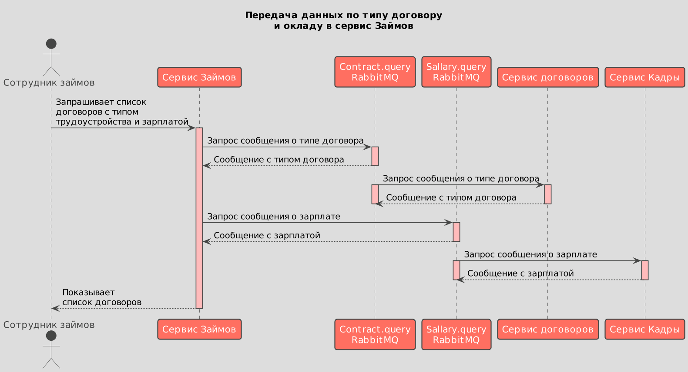
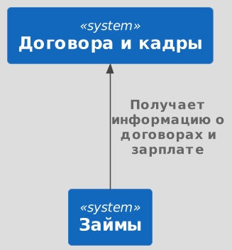
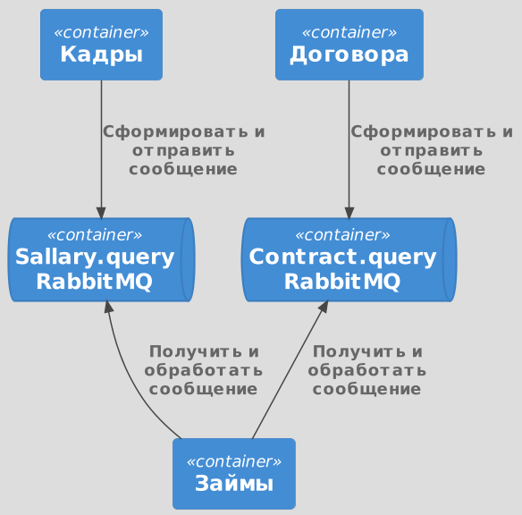

# Передача списка соотрудников с окладами и типом договора в сервис "Займов"

## Общие требования
1. Интеграция с сервисами:

* Сервис должен интегрироваться с сервисом "Договоры" для получения информации о типах договоров.
* Сервис должен интегрироваться с сервисом "Кадры" для получения информации о зарплате сотрудников.

2. Безопасность и Доступ:

* Доступ к информации о сотрудниках, их договорах и зарплате должен быть строго ограничен и требовать аутентификации.
* Должны быть реализованы меры защиты персональных данных сотрудников в соответствии с действующим законодательством.

3. Интерфейс пользователя:

* Предоставить пользовательский интерфейс для просмотра списка сотрудников, их типов договоров и зарплаты.
* Интерфейс должен поддерживать сортировку и фильтрацию по различным параметрам, включая имя сотрудника, тип договора и размер зарплаты.

## Функциональные требования

1. Просмотр списка сотрудников:

* Сервис должен предоставлять актуальный список сотрудников, полученный из сервиса "Кадры".

2. Получение и отображение типов договоров:

* Для каждого сотрудника сервис должен отображать тип договора, полученный из сервиса "Договоры".
* Должна быть возможность просмотра всех типов договоров, связанных с каждым сотрудником.

3. Получение и отображение зарплаты сотрудников:

* Для каждого сотрудника в списке должна отображаться месячная зарплата, полученная из сервиса "Кадры".
* Сервис должен обновлять информацию о зарплате в реальном времени или с минимальной задержкой.

4. Функционал поиска и фильтрации:

* Пользователи должны иметь возможность фильтровать список сотрудников по имени, типу договора и размеру зарплаты.
* Должна быть реализована функция поиска для удобства нахождения конкретных сотрудников или групп сотрудников по ключевым параметрам.

5. Экспорт данных:

* Предусмотреть возможность экспорта списка сотрудников с детальной информацией о договорах и зарплате в формате CSV или Excel для внешнего использования.

6. Обновление данных:
* Сервис должен регулярно обновлять данные о сотрудниках, их договорах и зарплатах для обеспечения актуальности информации.
* Должен быть механизм оповещения пользователя о необходимости обновления информации или автоматического обновления данных в фоновом режиме.

## Проблема 
На текущий момент в сервисе "Займов" отсутствует информация об окладе, типе трудоустройства в договоре и интерфейс просмотра этих данных. 

 ## Решение
1. Передавать в сервис "Займов" из сервиса "Договоров":
- Тип договора(тип трудоустройства).

2. Передавать в сервис "Займов" из сервиса "Кадры":
- Значение зарплаты сотрудника(основная и премиальная части)

3. Разработать интерфейс просмотра списка сотрудников в сервисе займов с доп. информацией по окладу и типу трудоустройства. 

## Технические требования:
1. Разработать и документировать API для взаимодействия с сервисами "Договоры" и "Кадры".
2. Обеспечить высокую доступность и надежность сервиса "Займы" для поддержания бесперебойной работы.
3. Реализовать логирование действий пользователей и системных ошибок для облегчения диагностики проблем.
4. Продумать стратегию масштабирования сервиса для поддержки растущего числа пользователей и объема данных.

Для обмена данными возможна два варианта интеграции:
* API
* Очередь сообщений

## Архитектура
* [Сценарии использования](#сценарии-использования)
* [Контекст](#контекст)
* [Контейнеры](#контейнеры)

### Сценарии использования 
Вариант - 1 
* [PlantUML](./flow.puml)

Интеграция через API
Плюсы:
* Прямое взаимодействие: API позволяет системам напрямую обмениваться данными, что может упростить интеграцию и ускорить разработку.
* Стандартизация: Существует множество стандартов и практик для разработки API, что облегчает интеграцию между различными системами.
* Синхронность: API обычно используются для синхронного взаимодействия, что обеспечивает немедленную обратную связь и упрощает обработку ошибок.
* Легкость доступа и использования: Современные API часто сопровождаются подробной документацией и клиентскими библиотеками, что упрощает их использование.
Минусы:
* Требования к доступности: Системы, интегрированные через API, обычно зависят от постоянной доступности друг друга, что увеличивает риски отказа.
* Масштабируемость: Может потребоваться дополнительная работа для обеспечения масштабируемости взаимодействий через API, особенно если одна из систем становится узким местом.
* Безопасность: Открытые API могут быть подвержены атакам, что требует реализации сложных механизмов безопасности и аутентификации.
* Зависимость от изменений: API может изменяться, и необходимо следить за обновлениями, чтобы избежать сбоев в интеграции.

Если сервсисы будут высоконагружены, можно рекомендовать использование балансировщиков перед каждым сервисом, чтобы выровнять нагрузку на ноды сервисов.

Вариант - 2
* [PlantUML](./flow2.puml)

### Контекст 
* [PlantUML](./context.puml)
* 

### Контейнеры 
* [PlantUML](./containers.puml)
* 

