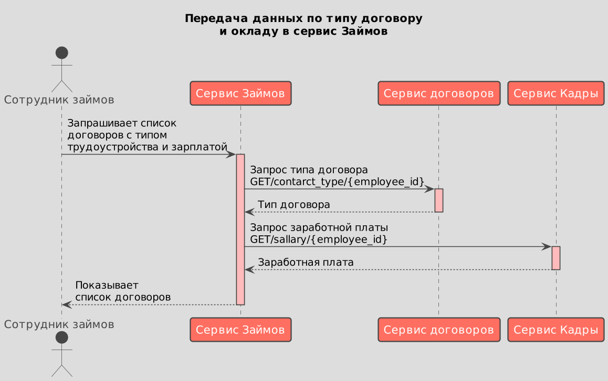

# Передача списка соотрудников с окладами и типом договора в сервис "Займов"

## Функциональные требования

1. Требование 1...
2. Требование 2...

## Проблема 
На текущий момент в сервисе "Займов" отсутствует информация об окладе, типе трудоустройства в договоре и интерфейс просмотра этих данных. 

 ## Решение
1. Передавать в сервис "Займов" из сервиса "Договоров":
- Тип договора(тип трудоустройства).

2. Передавать в сервис "Займов" из сервиса "Кадры":
- Значение зарплаты сотрудника(основная и премиальная части)

3. Разработать интерфейс просмотра списка сотрудников в сервисе займов с доп. информацией по окладу и типу трудоустройства. 

Для обмена данными возможна два варианта интеграции:
* API
* Очередь сообщений

## Архитектура
* [Сценарии использования](#сценарии-использования)
* [Контекст](#контекст)
* [Контейнеры](#контейнеры)

### Сценарии использования 
Вариант - 1 
* [PlantUML](./flow.puml)
* 
Вариант - 2
* [PlantUML](./flow2.puml)
* 

### Контекст 
* [PlantUML](./context.puml)
* 

### Контейнеры 

